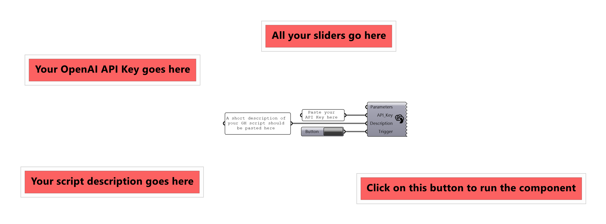
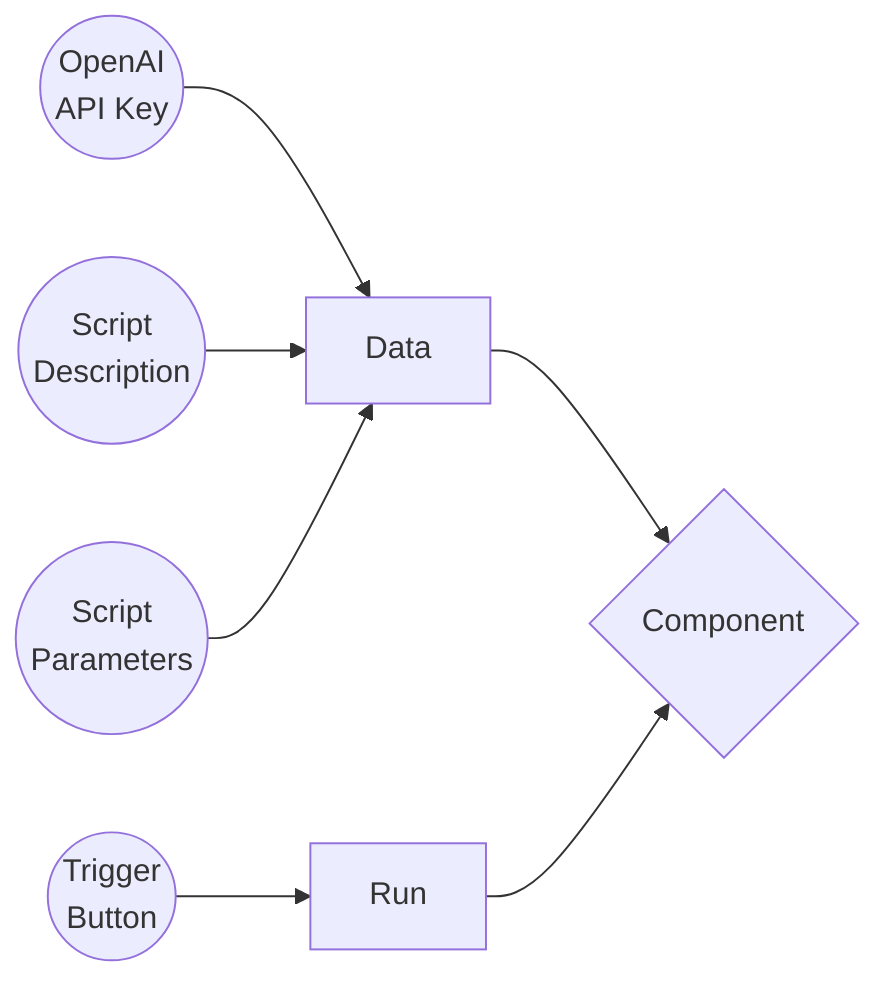
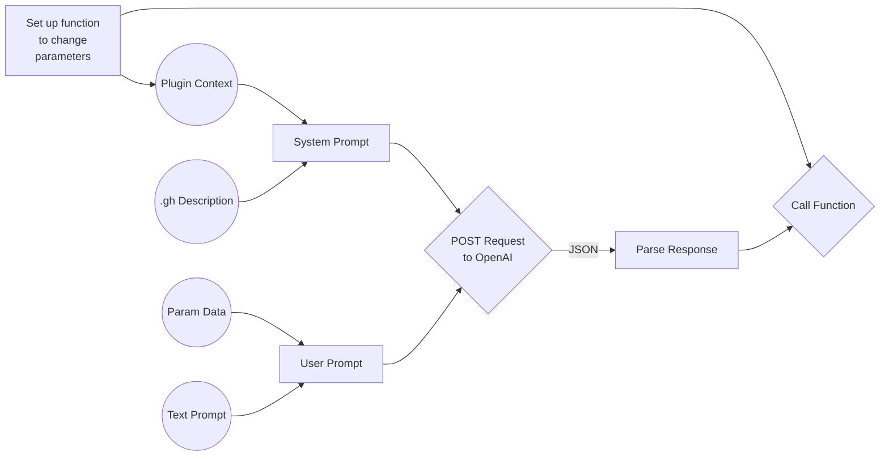

# Brain

**Brain is a GPT-powered Grasshopper component that lets you control your scripts through natural language.**

Remember that this tool only lets you manipulate your Grasshopper script using the parameters and the parameter domains that are already your script. If you're more interested in generating scripts using natural language, check out [GHPT](https://github.com/enmerk4r/GHPT).

## Installation

### Food4Rhino

Install the plug-in from [Food4Rhino](https://www.food4rhino.com/en/app/brain)

### Package Manager

Install the Brain Yak package from Rhino's Package Manager

### Build from source

For a more in-depth guide about building plugin files from source code, check out this thread by **Guilio Piacentino** on the [Rhinoceros Forums](https://discourse.mcneel.com/t/tutorial-creating-a-grasshopper-component-with-the-python-ghpy-compiler/38552)

## API Key Configuration

1. To be able to use your API Key, set up billing at [OpenAI's Billing Page](https://platform.openai.com/account/billing/overview).
2. Then go the [OpenAI's API Keys Page](https://platform.openai.com/account/api-keys) to generate your API Key.
3. Paste it in your Grasshopper script in a panel or save it somewhere safe since you will not be able to see it again.

For more information about API Costs, check out [OpenAI's Pricing](https://openai.com/pricing)

## How to use

You may also find example files [here]().

## How it works

### The Component

A simple flowchart explaining how the component is used.

### The “AI”

A simple flowchart explaining how the component gathers data about the parameters and sends an API call to OpenAI. 

**Plugin Context** is a short description about the component that goes into the `system` part of the prompt for the GPT3.5 API call. This part remains the same in every case and helps the model understand the context of the component.

**.gh Description** is a short description about the Grasshopper script that also goes into the `system` part of the prompt for the API call. This part is different for every case every case and is typed out by the user and plugged in to the component. This helps the model understand the context of the script itself.

**Param Data** is a set of all the parameters you would want to control, provided they are connected to the component. This chunk of text goes into the `user` part of the prompt for the API call and is collected everytime to account for any changes in the parameters.

**Text Prompt** is basically a short sentence in natural language describing what you want the component to do. This chunk of text also goes into the `user` part of the prompt for the API call and is arugably the most important part of the component.

## License

Copyright (C) 2023 lolrazh

The project 'Brain' is licensed under the GNU Lesser General Public License v3.0. For more details, please refer to the [LICENSE](LICENSE) file.

## Acknowledgements

- **[Kaushik LS](https://github.com/thekaushikls)** for helping me compile this project and for his other valuable inputs.

## Support 

Do you like my work? [Buy me a coffee](https://www.buymeacoffee.com/lolrazh) :)
